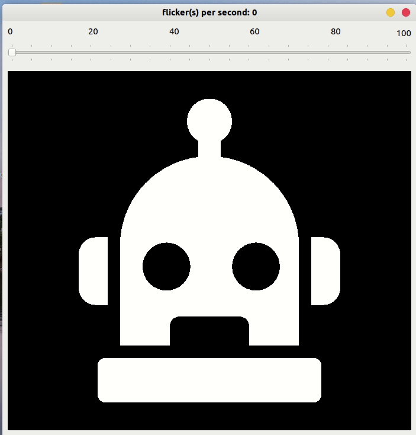

*(a flicker of a imgage is a when it goes away and comes back again quickly)*

## Ever heard of the [``Flicker Fusion Threshold``][wiki]? Me neither.

 Basically it states that if an image flickers with **``enough speed``** to a certain ***``N``*** flickers per second...
 
## ...the flickers will *``dissapear``*.

It's the mechanism that film projector uses to create the illusion of moving pictures.

But because of the monitor **``refreshing rate``**... 

...I suppose the flickers on monitor doesn't behave the same way as that in real life. 

#### ``>> Download and check it out for yourself!`` 

## How:

0. Install Python3 which comes with ``pip``

1. Upgrade ``pip``

```
>> pip3 install --upgrade pip
```
2. Go to the root folder of the project and run:

```
>> pip3 install -r requirements.txt
>> python3 main.py
```

[wiki]: https://en.wikipedia.org/wiki/Flicker_fusion_threshold

##  A glimpse of the program:


